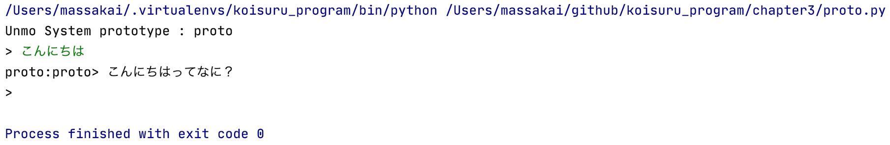
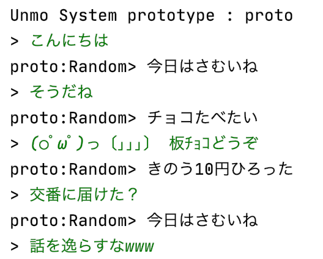
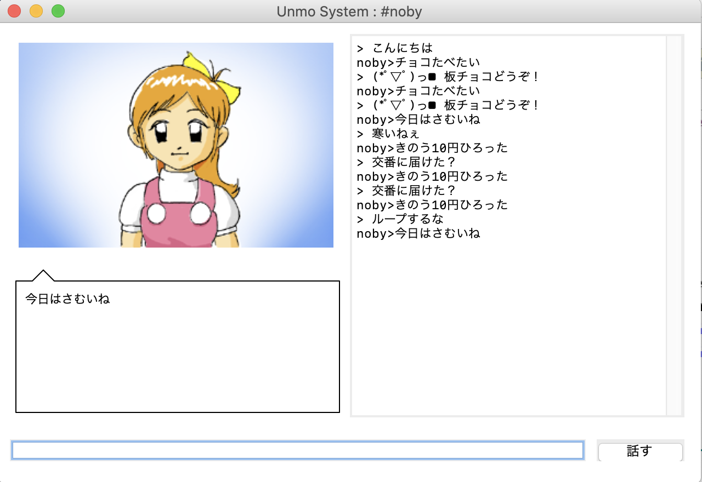
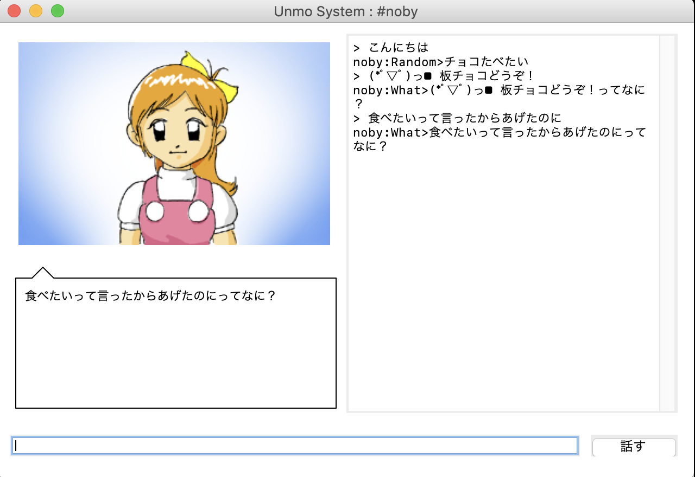

恋するプログラム Pythonでつくる人工無脳
#######################################

『`恋するプログラム Rubyでつくる人工無脳 <https://book.mynavi.jp/ec/products/detail/id=33771>`_』(秋山智俊 著)をPythonでやります。

第3章 ほんとに無脳
==================

3-3 最初の人工無脳 proto
------------------------

`cf76e7a4 <https://github.com/massakai/koisuru_program/blob/cf76e7a496a0ba0c5c0b05c2a5c0180f65ec91b0/chapter3/proto.py>`_

3-4 別のレスポンダー
--------------------

`6bcc2221 <https://github.com/massakai/koisuru_program/tree/6bcc22210672b6d9616fcec5b0bc106f6f535935/proto>`_

第4章 あこがれのGUI
===================

4-3 ノビィ
----------

`143f06cc <https://github.com/massakai/koisuru_program/tree/143f06cc7349b8593009300ea596cbb856091052>`_

4-4 Responderをランダムに切り換える
-----------------------------------

`7f8e424c  <https://github.com/massakai/koisuru_program/tree/7f8e424ca361818686b7a8876d47d77527575234>`_

