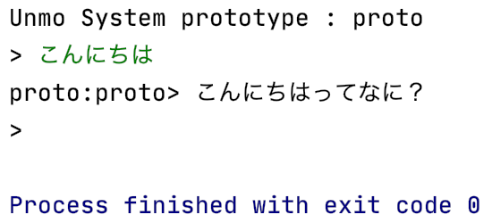

恋するプログラム Pythonでつくる人工無脳
#######################################

『`恋するプログラム Rubyでつくる人工無脳 <https://book.mynavi.jp/ec/products/detail/id=33771>`_』(秋山智俊 著)をPythonでやります。

第3章 ほんとに無脳
==================

3-3 最初の人工無脳 proto
------------------------

`proto.py <https://github.com/massakai/koisuru_program/blob/cf76e7a496a0ba0c5c0b05c2a5c0180f65ec91b0/chapter3/proto.py>`_

